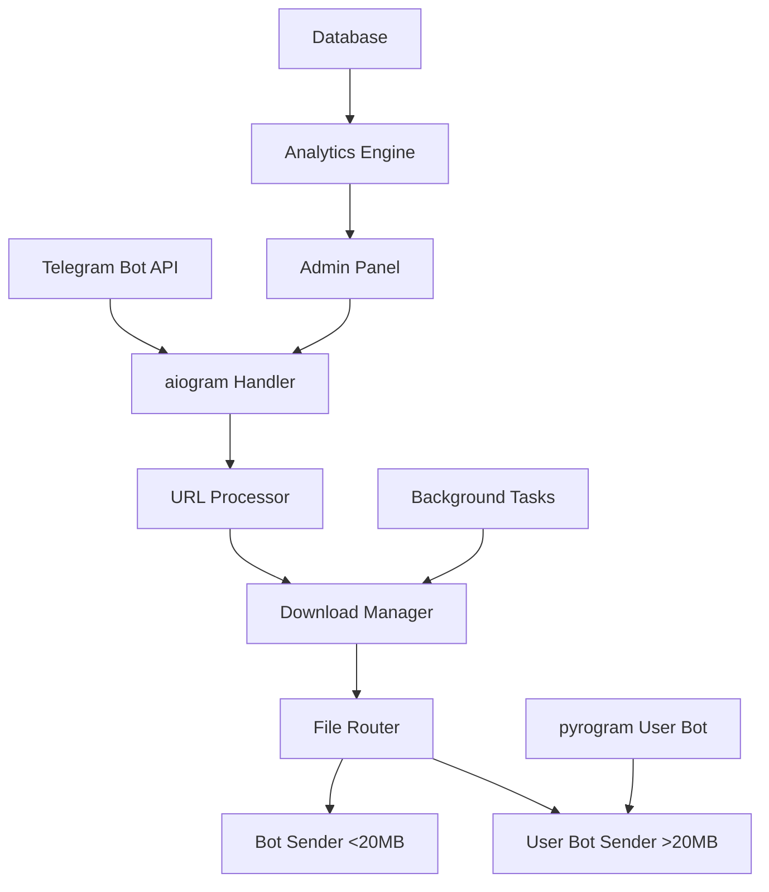

# Design Document

## Overview

Flash Saver Bot is designed as a dual-bot system using aiogram for the main bot interface and pyrogram for user bot capabilities to handle large file transfers. The architecture emphasizes asynchronous processing, real-time updates, and scalable file handling with intelligent routing between bot and user bot based on file size.

## Architecture

### Core Components



### Technology Stack

- **Bot Framework**: aiogram 3.x (latest)
- **User Bot**: pyrogram 2.x (latest)
- **Download Engine**: yt-dlp (latest), instaloader
- **Database**: SQLite with aiosqlite for async operations
- **Task Queue**: asyncio with custom queue management
- **File Processing**: FFmpeg for compression and conversion
- **Analytics**: matplotlib for chart generation

## Components and Interfaces

### 1. Bot Handler Layer (aiogram)

```python
class BotHandler:
    async def handle_url(message: Message)
    async def handle_callback(callback: CallbackQuery)
    async def handle_admin_commands(message: Message)
```

**Responsibilities:**
- Message routing and validation
- Inline keyboard management
- User session handling
- Admin command processing

### 2. URL Processor

```python
class URLProcessor:
    async def detect_platform(url: str) -> Platform
    async def extract_metadata(url: str) -> MediaInfo
    async def validate_url(url: str) -> bool
```

**Supported Platforms:**
- Instagram (posts, reels, stories)
- YouTube (videos, playlists, shorts)

### 3. Download Manager

```python
class DownloadManager:
    async def download_video(url: str, quality: str) -> DownloadResult
    async def download_playlist(url: str, quality: str) -> List[DownloadResult]
    async def extract_audio(video_path: str) -> str
    async def compress_video(video_path: str, target_size: int) -> str
```

**Features:**
- Concurrent downloads with semaphore limiting
- Progress tracking with real-time updates
- Automatic quality selection and fallback
- Smart compression based on target platform limits

### 4. File Router

```python
class FileRouter:
    async def route_file(file_path: str, chat_id: int) -> SendMethod
    async def send_via_bot(file_path: str, chat_id: int)
    async def send_via_userbot(file_path: str, chat_id: int)
```

**Logic:**
- Files <20MB: Use bot API
- Files 20MB-2GB: Use user bot (pyrogram)
- Automatic fallback and retry mechanisms

### 5. User Bot Handler (pyrogram)

```python
class UserBotHandler:
    async def send_large_file(file_path: str, chat_id: int)
    async def upload_with_progress(file_path: str, chat_id: int)
```

### 6. Admin Panel

```python
class AdminPanel:
    async def show_dashboard() -> InlineKeyboard
    async def get_health_status() -> HealthReport
    async def get_user_statistics() -> UserStats
    async def broadcast_message(message: str)
    async def generate_charts() -> List[str]
```

## Data Models

### User Model
```python
@dataclass
class User:
    user_id: int
    username: str
    first_name: str
    join_date: datetime
    download_count: int
    last_activity: datetime
```

### Download Model
```python
@dataclass
class Download:
    id: int
    user_id: int
    url: str
    platform: str
    file_size: int
    quality: str
    status: DownloadStatus
    created_at: datetime
    completed_at: datetime
```

### Analytics Model
```python
@dataclass
class Analytics:
    date: datetime
    total_downloads: int
    successful_downloads: int
    failed_downloads: int
    unique_users: int
    platform_breakdown: Dict[str, int]
```

## Error Handling

### Error Categories
1. **Network Errors**: Retry with exponential backoff
2. **Platform Errors**: Graceful degradation with user notification
3. **File Size Errors**: Automatic compression or quality reduction
4. **Rate Limiting**: Queue management with user notifications

### Error Response Strategy
```python
ERROR_RESPONSES = {
    "network_error": "🌐 Connection issue, retrying...",
    "invalid_url": "❌ Invalid link",
    "file_too_large": "📦 Compressing file...",
    "platform_unavailable": "⚠️ Platform temporarily unavailable"
}
```

## Testing Strategy

### Unit Tests
- URL validation and parsing
- Download manager functionality
- File routing logic
- Admin panel operations

### Integration Tests
- End-to-end download workflows
- Bot and user bot coordination
- Database operations
- Error handling scenarios

### Performance Tests
- Concurrent download handling
- Large file transfer efficiency
- Memory usage optimization
- Response time benchmarks

## Security Considerations

### Bot Token Security
- Environment variable storage
- Token rotation capability
- Secure admin authentication

### User Bot Session
- Session file encryption
- API credentials protection
- Rate limit compliance

### File Handling
- Temporary file cleanup
- Path traversal prevention
- File type validation

## Deployment Architecture

### File Structure
```
flash_saver_bot/
├── bot/
│   ├── handlers/
│   ├── middleware/
│   └── keyboards/
├── userbot/
│   └── client.py
├── core/
│   ├── downloader.py
│   ├── processor.py
│   └── router.py
├── admin/
│   ├── panel.py
│   └── analytics.py
├── database/
│   ├── models.py
│   └── operations.py
├── utils/
│   ├── helpers.py
│   └── constants.py
└── main.py
```

### Environment Configuration
```
BOT_TOKEN=7831964087:AAE74UKevo-OFYHKFIxpjKnMDWwUZKBWju0
ADMIN_USERNAME=ablaze_coder
API_ID=your_api_id
API_HASH=your_api_hash
PHONE_NUMBER=your_phone_number
```

## Performance Optimizations

### Async Processing
- Non-blocking download operations
- Concurrent file processing
- Async database operations

### Memory Management
- Streaming file transfers
- Temporary file cleanup
- Memory-efficient video processing

### Caching Strategy
- URL metadata caching
- User preference caching
- Download history optimization